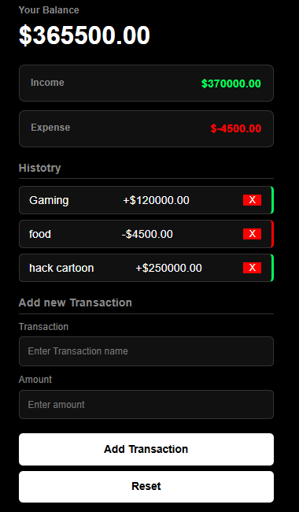

# 💳 Expense Tracker App

> An interactive personal finance application that allows users to record, categorize, and analyze daily expenses with persistent storage and real-time budget calculations.

---

## 📌 Problem Statement
Managing personal finances can be overwhelming without a clear breakdown of where money is going. Many existing budgeting tools are bloated, slow, or lock data behind accounts. This Expense Tracker solves this by providing a streamlined, fast-loading interface that allows users to instantly log expenses, see categorized breakdowns, and stay on top of their financial goals.

---

## 🎯 Project Goals
- Enable users to **dynamically add, edit, and delete daily expenses**.
- Automatically calculate and display real-time metrics like total balance, total income, and remaining budget.
- Provide clear visual grouping or filtering of expenses by categories (e.g., Food, Rent, Entertainment).
- Deliver a smooth, ultra-fast user experience with persistent local storage.

---

## 🛠️ Tech Stack
**Technologies Used:**
- **HTML5:** For semantic page structuring, transaction forms, and data tables.
- **CSS3:** For a modern, clean, and mobile-responsive financial dashboard.
- **JavaScript (ES6+):** For managing application state, DOM updates, and mathematical calculations.

**Data Persistence:**
- **Web Storage API (`localStorage`):** Used to securely cache financial data locally so logs are preserved across page reloads.

---

## 🖥️ Features
- **Dynamic Transaction Logging:** Instantly add income or expense items with titles, amounts, and tags.
- **Real-Time Balance Updates:** Automatically recalculates total savings and expenditures with every modification.
- **Persistent Storage:** Saves financial history to `localStorage` so users never lose their logs.
- **Category Filtering:** Group and view transaction history sorted by custom spending types.

---

## 📷 Screenshots


---

## ⚙️ Installation & Setup
To clone and run this project locally, execute the following commands in your terminal:

```bash
# Clone the repository
git clone https://github.com

# Navigate into the project directory
cd Expense-Tracker

# Switch branch to feature/Expense_Tracker if you are on the main branch
git checkout feature/Expense_Tracker
```

---

## 🧠 Challenges Faced
- **State Synchronization:** Ensuring the visual transaction list always matches the underlying JavaScript array and `localStorage` state perfectly.
- **Form Validation & Types:** Preventing empty or negative value submissions and handling data type casting (converting string inputs into floating-point numbers for accurate math).
- **DOM Efficiency:** Re-rendering the dynamic list efficiently without causing page lag or unnecessary layout shifts.

---

## 📚 What I Learned
- **CRUD Operations:** Implementing core Create, Read, Update, and Delete logic using vanilla JavaScript.
- **Data Persistence:** Leveraging `localStorage` to stringify and parse complex structural arrays seamlessly.
- **Mathematical Safety:** Using strict precision methods to ensure financial additions and subtractions never suffer from floating-point errors.

---

## 🚀 Future Improvements
- **Interactive Budget Charts:** Integrating a library like Chart.js or ApexCharts to display monthly visual expense breakdowns in a pie chart.
- **Monthly Budget Targets:** Allowing users to set a strict spending cap and triggering color-coded alerts if they get close to exceeding it.
- **Export to CSV:** Adding a feature to download transaction history as a spreadsheet-ready file.

---

## 👨🏽‍💻 Author
**Russel Fonta Fadil**  
*Junior Fullstack Developer*  
- 📩 **Email:** fontawestbrook99@gmail.com  
- 🌍 **Location:** Cameroon (Open to remote opportunities)  
- 💼 **GitHub:** [RusselFonta](https://github.com)
